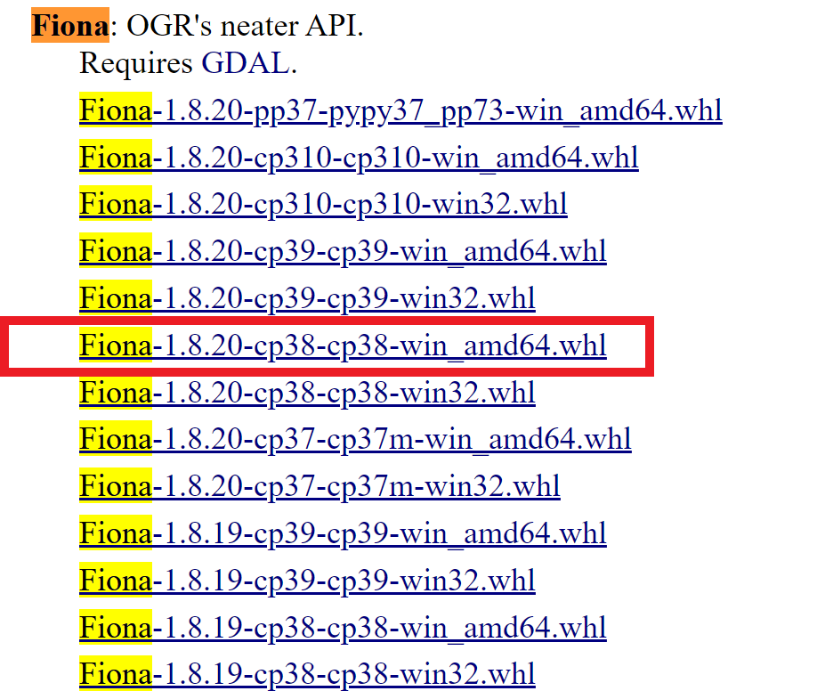

## **Research Background**

The mitigation policies or lockdown measures imposed by local and national gov-ernments to control the spread of COVID-19 have created drastic changes in people's livelihood, economy, and environment. We investigated the impacts of the COVID-19 crisis on the atmospheric environment by comprehensively understanding the spatio-temporal patterns of air pollutants in California, USA. The investigation results provided knowledge about humans and environmental re-sponses to the pandemic.

**Pre-requisite**

1. Python IDE (Visual Studio Code, Pycharm, or anything of your choice)
2. Python 2.7 or above
3. Anaconda 3

**Steps**

* Step 1: Create a new folder and name it as per your preference. For example, let's say CA-Air Pollution

* Step 2: Download the project related materials using the link. The downloaded folder has below folders and files:
  
    1. Air Pollutants Data - This folder has satellite NO2 observations data. It has three sub-folders: pre, peri, and post
    2. Air Quality Analytical Tool - This folder has 


* Step 3: Open the command prompt/terminal in your system. Navigate to your project folder CA-Air Pollution
  
  ```
  cd CA-Air Pollution
  ```

* Step 4: Create a new conda environment.

    **For Windows and Mac**

    ```
    conda create -n env-analysis-no2 python=3.8
    ```

    

* Step 5: Activate the conda environment.

    **For Windows and Mac**

    ```
    conda activate env-analysis-no2
    ```

    


* Step 6: Install packages for the script.

    1. Execute below comment to install required python packages.<br/>

    ```
    pip install -r requirements.txt
    ```

   2. Next, install gdal, fiona, and geopandas. To successfully install these packages, first install GDAL, second install fiona, and last install geopandas.
   
      1. Using this [link](https://www.lfd.uci.edu/~gohlke/pythonlibs/), download GDAL‑3.3.3‑cp38‑cp38‑win_amd64.whl, Fiona‑1.8.20‑cp38‑cp38‑win_amd64.whl, and 
         geopandas-0.10.2-py2.py3-none-any.whl files.
   
   # GDAL WHL screenshot

    

   # Fiona WHL screenshot
   
   

   # Geopandas WHL screenshot

   


   3. In terminal, install the packages using pip. For example to install GDAL, type
   
    ```
    pip install [path_where_you_download_GDAL_WHL_FILE]
    ```
   
   

   4. Similarly, install fiona package.
   
   ```
   pip install [path_where_you_download_FIONA_WHL_FILE]
   ```
   
   


   5. Finally, install geopandas package.

   ```
   pip install [path_where_you_download_GEOPANDAS_WHL_FILE]
   ```
   
   

   6. Install matplotlib and basemap packages using
   
   ```
   conda install matplotlib
   ```

   ```
   conda install -c conda-forge basemap
   ```

* Step 7: Run the script OMI_statitic_ca.py to calculate periodical (pre, peri, and post) means of 2020 and 2015-2019, and their differences. Change the below variables accordingly.

1. period – either pre, peri, or post
2. infolder – root directory for input files
3. output_dir – root directory for output files
4. period1 – former period
5. period2 – latter period
6. path – root directory for input files

**Results**

1. california_counties_covid_env_data.xlsx contains daily average concentration for each pollutant. Seven-day moving average and standard error are calculated in using excel.

**Useful links**

2. Ground-based observations of air pollutants: https://www.epa.gov/outdoor-air-quality-data/download-daily-data

3. Satellite NO2 observations: [https://disc.gsfc.nasa.gov/datasets/OMNO2d_003/summary](https://disc.gsfc.nasa.gov/datasets/OMNO2d_003/summary)

4. National highways: https://catalog.data.gov/dataset/tiger-line-shapefile-2016-nation-u-s-primary-roads-national-shapefile


**Author**

Qian Liu<br>
Email: qliu6@gmu.edu


**Tutorial Video**

[](https://www.youtube.com/watch?v=hwQF3_ZJSJY)

